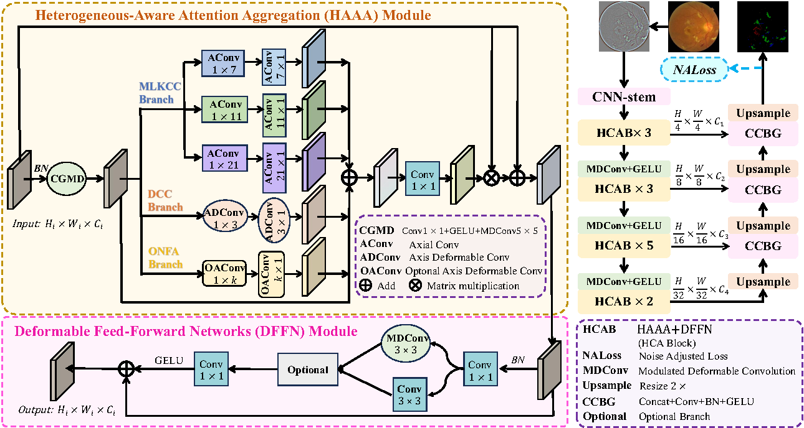
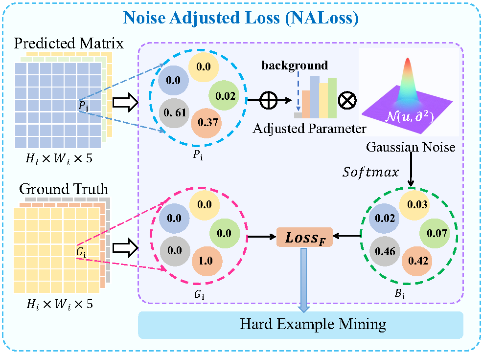
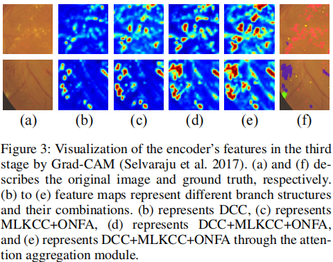

# AAAI24: HACDR-Net

## Abstract

Diabetic Retinopathy (DR), the leading cause of blindness in diabetic patients, is diagnosed by the condition of retinal multiple lesions. As a difficult task in medical image segmentation, DR multi-lesion segmentation faces the main concerns as follows. On the one hand, retinal lesions vary in location, shape, and size. On the other hand, because some lesions occupy only a very small part of the entire fundus image, the high proportion of background leads to difficulties in lesion segmentation. To solve the above problems, we propose a heterogeneous-aware convolutional network (HACDR-Net) that composes heterogeneous cross-convolution, heterogeneous modulated deformable convolution, and optional near-far-aware convolution. Our network introduces an adaptive aggregation module to summarize the heterogeneous feature maps and get diverse lesion areas in the heterogeneous receptive field along the channels and space. In addition, to solve the problem of the highly imbalanced proportion of focal areas, we design a new medical image segmentation loss function, Noise Adjusted Loss (NALoss). NALoss balances the predictive feature distribution of background and lesion by jointing Gaussian noise and hard example mining, thus enhancing awareness of lesions. We conduct the experiments on the public datasets IDRiD and DDR, and the experimental results show that the proposed method achieves better performance than other state-of-the-art methods.




## Requirements

This code is based on [mmsegmentation 0.x](https://github.com/open-mmlab/mmsegmentation).

```
* PyTorch 1.10.0+
* Python 3.8
* CUDA 10.1+
* mmsegmentation=0.30.0
* mmcv-full=1.6.2
```

## Datasets

We evaluate our method on [IDRiD](https://ieee-dataport.org/open-access/indian-diabetic-retinopathy-image-dataset-idrid) and [DDR](https://github.com/nkicsl/DDR-dataset). In the future, we will also open source the private dataset of diabetic retinopathy segmentation that we have collected.

## Visualization



## Code

Our code is about to be open-sourced.
